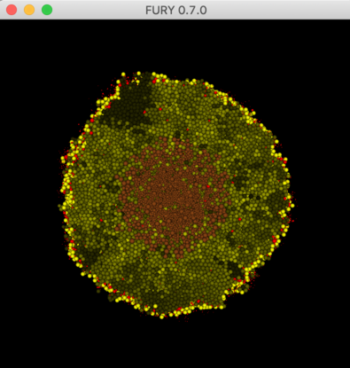

# PhysiCell-Fury

Use [Fury](https://fury.gl/) to visualize output from a PhysiCell 3-D model.

Assuming you have installed the [Anaconda Python](https://www.anaconda.com/products/individual), you can install Fury using its `pip` command:

```bash
pip install fury
```
After it finishes installing, you should be able to run this script (which uses files in the /data directory). 
```bash
python tumor_vis.py
```


When the Fury window appears, you should be able to interact with the data using your mouse or trackpad:
* click (mouse: button 1),  drag to rotate
* shift- click (mouse: button 2), drag to pan
* shift-control click (mouse: button 3), drag to zoom


Compare the visualization with [this video](https://www.youtube.com/watch?v=16EyDBf0l_M&list=PL1IHi3Kb0zyn-HBXeMBLjTU_-rFEKqFKM&index=1) at about 15 secs from the start.

This next script provides sliders for slicing planes to let you "cut" into the 3-D tumor, and also a slider to step through time steps of data.

```bash
python tumor_vis_sliders.py
```


(after rotating and panning the tumor)
